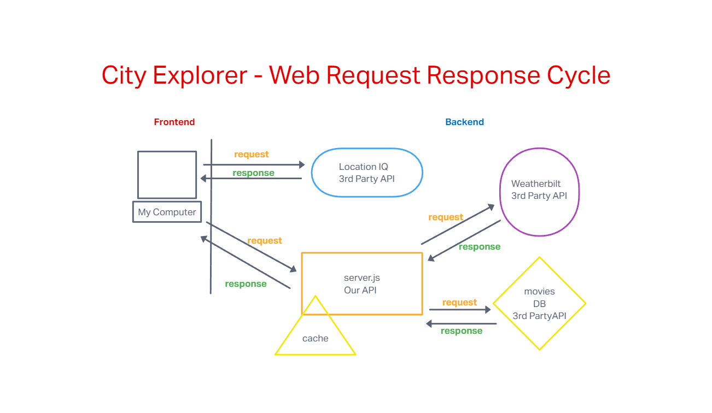

# Project Name

**Author**: Your Name Goes Here
**Version**: 1.0.0 (increment the patch/fix version number if you make more commits past your first submission)

## Overview
<!-- Provide a high level overview of what this application is and why you are building it, beyond the fact that it's an assignment for this class. (i.e. What's your problem domain?) -->
This is a React application that uses the Axios library to make user-initiated requests for data from a third-party API.

## Getting Started
<!-- What are the steps that a user must take in order to build this app on their own machine and get it running? -->

## Architecture
<!-- Provide a detailed description of the application design. What technologies (languages, libraries, etc) you're using, and any other relevant design information. -->

## Change Log

08-22-2022 5:30pm - React application generated and connected to repo on Github.  -->

## Credit and Collaborations

Dan Awesome
Stephen Clemmer
Luis Rosales

## Daily Work Log

### Monday, Aug. 22, 2022

### Name of feature: Geocoding API

### Estimate of time needed to complete: 3 hrs

### Start time: 5:22pm

### Finish time: 11:52pm

### Actual time needed to complete: 6hrs

### Tuesday, Aug. 23, 2022

### Name of feature: Geocoding API

### Estimate of time needed to complete: 3 hrs

### Start time: 5:22pm

### Finish time

### Actual time needed to complete

### Wednesday, Aug. 24, 2022

### Name of feature: Geocoding API

### Estimate of time needed to complete: 3 hrs

### Start time: 5:22pm

### Finish time

### Actual time needed to complete

### Thursday, Aug. 25, 2022

### Name of feature: Geocoding API

### Estimate of time needed to complete: 3 hrs

### Start time: 5:22pm

### Finish time

### Actual time needed to complete

### Friday, Aug. 26, 2022

### Name of feature: Geocoding API

### Estimate of time needed to complete: 3 hrs

### Start time: 5:22pm

### Finish time

### Actual time needed to complete
